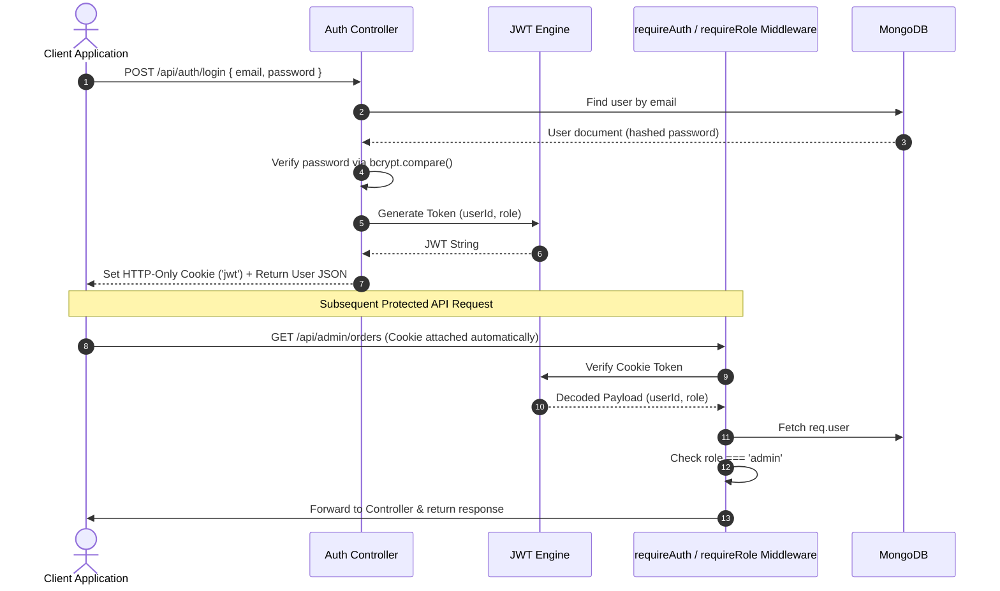
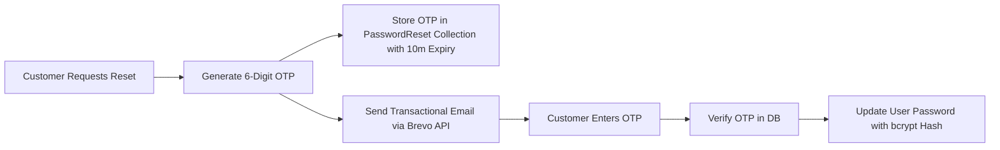

# Sky Lounge Restaurant — Backend API


The robust, production-grade RESTful API backend powering the **Sky Lounge Restaurant** platform. Built with Node.js, Express, and MongoDB (Mongoose ODM), this backend service provides comprehensive APIs for user authentication, role-based authorization, menu management, cart persistence, order creation and status tracking, table reservations, customer review moderation, Brevo OTP email delivery, and Cloudinary media processing.

---

## ⚙️ Backend Features

- **JWT Session Authentication**: Cookie-based authentication storing JSON Web Tokens in HTTP-only, secure, same-site cookies to prevent XSS.
- **Role-Based Authorization**: Fine-grained authorization middleware gating general customer endpoints and admin management routes.
- **Menu Catalog Management**: Full CRUD operations for menu items, portion price variations, category assignments, and sold-out status (`isAvailable`).
- **Category & Popularity Engine**: Category management endpoints supporting display ordering, category banners, and home page popular toggling.
- **Persistent Cart Engine**: Synchronizes user shopping carts to MongoDB, maintaining item state across customer devices.
- **Order Lifecycle Management**: Order processing pipeline generating unique order numbers, managing payment status (Paid/Unpaid), and transitioning order progress (`Pending` ➔ `Preparing` ➔ `Ready` ➔ `Delivered` / `Cancelled`).
- **Table Reservation System**: Endpoint handling table booking requests, guest counts, requested time slots, and status approval (`pending`, `confirmed`, `cancelled`).
- **Review Moderation System**: Public review retrieval and authenticated customer submission coupled with administrative approval control (`isApproved`).
- **Cloudinary Image Processing**: Direct multipart form uploads via Multer memory storage into organized Cloudinary folders, URL resolution, asset replacement, and automatic old asset deletion.
- **Brevo Email Service & OTP**: Automated 6-digit OTP delivery via Brevo transactional emails for password recovery with timed expiry in MongoDB.
- **User Management & History Search**: Admin APIs to search registered users by keyword and inspect complete individual customer order histories.
- **Input Validation & Security Hardening**: Zod schema request validation, Helmet HTTP security headers, CORS origin whitelisting, Morgan request logging, and granular rate-limiting (general API, authentication, and OTP limits).

---

## 🛠️ Tech Stack

| Dependency | Version | Usage Purpose |
| :--- | :--- | :--- |
| **Node.js** | v18+ | JavaScript runtime environment |
| **Express.js** | 4.19.2 | Web framework for REST API routing and middleware |
| **MongoDB & Mongoose** | 8.4.1 | NoSQL database & Object Data Modeling (ODM) layer |
| **JSONWebToken (`jsonwebtoken`)** | 9.0.2 | Token generation and verification for session auth |
| **`bcryptjs`** | 2.4.3 | Secure password hashing algorithm |
| **Cloudinary SDK** | 2.10.1 | Cloud media storage, transformations, and deletion API |
| **Multer** | 2.2.0 | Node.js middleware for handling `multipart/form-data` uploads |
| **Brevo (`@getbrevo/brevo`)** | 6.0.3 | Transactional SMTP email delivery engine for OTPs |
| **Cookie Parser** | 1.4.6 | Middleware to parse HTTP request cookies |
| **Zod** | 3.23.8 | Strict schema-based request body validation |
| **Helmet** | 7.1.0 | HTTP response headers security middleware |
| **Express Rate Limit** | 7.3.0 | API rate-limiting to protect against DDoS & brute-force |
| **Morgan** | 1.10.0 | HTTP request logger middleware |
| **Dotenv** | 16.4.5 | Environment variable configuration loader |

---

## 📑 API Endpoint Documentation

### Authentication (`/api/auth`)
| Method | Endpoint | Description | Auth Level |
| :--- | :--- | :--- | :--- |
| `POST` | `/api/auth/register` | Register a new customer account | Public (Rate Limited) |
| `POST` | `/api/auth/login` | Authenticate user & issue HTTP-only JWT cookie | Public (Rate Limited) |
| `POST` | `/api/auth/logout` | Clear authentication cookie | Public |
| `GET` | `/api/auth/me` | Fetch currently logged-in user profile | Authenticated User |
| `PUT` | `/api/auth/profile` | Update account profile details | Authenticated User |
| `POST` | `/api/auth/forgot-password` | Request 6-digit OTP email via Brevo | Public (Rate Limited) |
| `POST` | `/api/auth/verify-otp` | Verify validity of 6-digit OTP code | Public (Rate Limited) |
| `POST` | `/api/auth/reset-password` | Set new password using verified OTP | Public (Rate Limited) |

### Menu (`/api/menu`)
| Method | Endpoint | Description | Auth Level |
| :--- | :--- | :--- | :--- |
| `GET` | `/api/menu` | List menu items with pagination & category filter | Public |
| `GET` | `/api/menu/:id` | Fetch single menu item by ID | Public |
| `POST` | `/api/menu` | Create a new menu item | Admin |
| `PUT` | `/api/menu/:id` | Update existing menu item details | Admin |
| `DELETE` | `/api/menu/:id` | Delete menu item & associated image | Admin |

### Categories (`/api/categories`)
| Method | Endpoint | Description | Auth Level |
| :--- | :--- | :--- | :--- |
| `GET` | `/api/categories` | Get all menu categories | Public |
| `GET` | `/api/categories/popular` | Get categories marked as popular for home page | Public |
| `GET` | `/api/categories/:id` | Get category details by ID | Public |
| `POST` | `/api/categories` | Create new food category | Admin |
| `PUT` | `/api/categories/:id` | Update category details/popular status | Admin |
| `DELETE` | `/api/categories/:id` | Delete food category | Admin |

### Cart (`/api/cart`)
| Method | Endpoint | Description | Auth Level |
| :--- | :--- | :--- | :--- |
| `GET` | `/api/cart` | Get authenticated user's persistent cart | Authenticated User |
| `POST` | `/api/cart` | Sync/Update items in user's cart | Authenticated User |
| `DELETE` | `/api/cart` | Clear all items from user's cart | Authenticated User |

### Orders (`/api/orders`)
| Method | Endpoint | Description | Auth Level |
| :--- | :--- | :--- | :--- |
| `POST` | `/api/orders` | Create order from cart & clear active cart | Authenticated User |
| `GET` | `/api/orders/my` | Get logged-in user's personal order history | Authenticated User |
| `GET` | `/api/orders/:id` | Get order details by ID or Order Number | Optional / Auth |

### Table Reservations (`/api/reservations`)
| Method | Endpoint | Description | Auth Level |
| :--- | :--- | :--- | :--- |
| `POST` | `/api/reservations` | Submit table reservation request | Authenticated User |
| `GET` | `/api/reservations/my` | Get logged-in user's reservations | Authenticated User |

### Customer Reviews (`/api/reviews`)
| Method | Endpoint | Description | Auth Level |
| :--- | :--- | :--- | :--- |
| `GET` | `/api/reviews` | Get list of approved customer reviews | Public |
| `POST` | `/api/reviews` | Submit a customer rating and review | Authenticated User |

### Gallery (`/api/gallery`)
| Method | Endpoint | Description | Auth Level |
| :--- | :--- | :--- | :--- |
| `GET` | `/api/gallery` | Get all restaurant ambiance & dish gallery images | Public |

### Admin Portal (`/api/admin`)
| Method | Endpoint | Description | Auth Level |
| :--- | :--- | :--- | :--- |
| `GET` | `/api/admin/dashboard` | Fetch dashboard analytics metrics & stats | Admin |
| `GET` | `/api/admin/orders` | Get all restaurant orders across all users | Admin |
| `PATCH` | `/api/admin/orders/:id/status` | Update order stage or payment status | Admin |
| `GET` | `/api/admin/user-orders` | Fetch specific user order history by search query | Admin |
| `GET` | `/api/admin/reservations` | Get all customer table reservations | Admin |
| `PATCH` | `/api/admin/reservations/:id/status` | Confirm or cancel reservation request | Admin |
| `GET` | `/api/admin/users` | List registered user accounts | Admin |
| `GET` | `/api/admin/users/search` | Search users by name, email, or phone | Admin |
| `PATCH` | `/api/admin/users/:id` | Toggle user active/blocked status | Admin |
| `GET` | `/api/admin/reviews` | Get all customer reviews (including pending) | Admin |
| `PATCH` | `/api/admin/reviews/:id` | Approve or unapprove customer review | Admin |
| `DELETE` | `/api/admin/reviews/:id` | Delete customer review | Admin |
| `POST` | `/api/admin/gallery` | Add image entry to restaurant gallery | Admin |
| `DELETE` | `/api/admin/gallery/:id` | Delete photo entry from gallery | Admin |
| `POST` | `/api/admin/upload/image` | Upload image file to Cloudinary | Admin |
| `DELETE` | `/api/admin/upload/image` | Remove image file from Cloudinary by `publicId` | Admin |

---

## 🔒 Authentication & Authorization Architecture



### Data Isolation Guarantees
- **Customer Data Scope**: Database queries for user orders (`/api/orders/my`), carts (`/api/cart`), and reservations (`/api/reservations/my`) strictly enforce `{ user: req.user._id }`. Users cannot read or mutate data belonging to other accounts.
- **Admin Data Scope**: Admin controllers (`adminController.js`) require both valid JWT authentication (`requireAuth`) and explicit administrative role checks (`requireRole('admin')`).

---

## 🗄️ Database Schemas & Models

The MongoDB database consists of 9 Mongoose schemas located in `src/models/`:

1. **`User`**:
   - `name`, `email` (unique), `password` (hashed), `phone`, `role` (`'customer'` or `'admin'`), `isBlocked` (boolean).
2. **`MenuItem`**:
   - `name`, `description`, `price`, `priceOptions` (`[{ portion, price }]`), `category` (ObjectId ref to Category), `image` (URL string), `publicId` (Cloudinary ID), `isAvailable`, `isPopular`.
3. **`Category`**:
   - `name`, `slug` (unique), `description`, `image`, `publicId`, `isPopular`, `order` (number).
4. **`Order`**:
   - `orderNumber` (unique generated string e.g. `SL-10823`), `user` (ObjectId ref to User), `items` (`[{ menuItem, name, price, quantity, portion }]`), `totalAmount`, `paymentStatus` (`'unpaid'`, `'paid'`, `'refunded'`), `orderStatus` (`'pending'`, `'preparing'`, `'ready'`, `'delivered'`, `'cancelled'`), `deliveryAddress`, `contactPhone`, `specialInstructions`.
5. **`Cart`**:
   - `user` (ObjectId ref to User, unique), `items` (`[{ menuItem, name, price, quantity, portion, cartKey }]`).
6. **`Reservation`**:
   - `user` (ObjectId ref to User), `name`, `email`, `phone`, `date`, `time`, `partySize`, `specialRequests`, `status` (`'pending'`, `'confirmed'`, `'cancelled'`).
7. **`Review`**:
   - `user` (ObjectId ref to User), `name`, `rating` (1–5), `comment`, `isApproved` (boolean default false).
8. **`Gallery`**:
   - `title`, `image`, `publicId`, `category` (e.g. Ambiance, Dishes, Events).
9. **`PasswordReset`**:
   - `email`, `otp` (6-digit string), `expiresAt` (TTL index for automatic MongoDB cleanup).

---

## ☁️ Cloudinary Image Integration

Image processing is implemented in `src/config/cloudinary.js`, `src/utils/cloudinaryHelper.js`, and `src/controllers/uploadController.js`.

### Workflow
1. **Upload**: Multipart form requests sent to `/api/admin/upload/image` are parsed using Multer memory storage (`uploadMiddleware.js`).
2. **Folder Structuring**: Images are stored in organized Cloudinary directories based on asset type:
   - Menu Items: `skylounge/menu/<category_name>`
   - Categories: `skylounge/categories`
   - Gallery: `skylounge/gallery`
3. **Asset Resolution**: The controller returns both `url` (`secure_url`) and `publicId`. Both are stored in MongoDB.
4. **Deletion & Replacement**: When an item or gallery image is removed or replaced, `deleteImageFromCloudinary(publicId)` is invoked to purge old assets from Cloudinary.

> [!IMPORTANT]
> Preset fallback images (e.g. default placeholder images) are protected, ensuring standard system assets are never deleted accidentally.

---

## 📧 Brevo Email OTP Integration

Password reset uses Brevo's transactional API (`@getbrevo/brevo`) implemented in `src/utils/sendEmail.js`.



---

## 🔑 Environment Variables

Create a `.env` file in the `backend/` directory:

```env
# Server Setup
PORT=5000
NODE_ENV=development
CLIENT_URL=http://localhost:5173

# Database Connection
MONGODB_URI=mongodb+srv://<username>:<password>@<cluster>.mongodb.net/skylounge?retryWrites=true&w=majority

# JWT Session Configuration
JWT_SECRET=your_super_secret_jwt_key_min_32_chars
JWT_EXPIRES_IN=7d

# Default Initial Admin Credentials (for seed script)
ADMIN_NAME=Admin name
ADMIN_EMAIL=admin@gmail.com
ADMIN_PASSWORD=your_secure_admin_password
ADMIN_PHONE=xxxxxxxxxx

# Brevo Transactional Email Configuration
BREVO_API_KEY=your_brevo_api_key
BREVO_SENDER_EMAIL=noreply@.com
BREVO_SENDER_NAME=sender name

# Cloudinary Storage Configuration
CLOUDINARY_CLOUD_NAME=your_cloudinary_cloud_name
CLOUDINARY_API_KEY=your_cloudinary_api_key
CLOUDINARY_API_SECRET=your_cloudinary_api_secret
CLOUDINARY_UPLOAD_PRESET=your_preset
```

> [!WARNING]
> Never commit `.env` files or credentials to Git. Add `.env` to `.gitignore` and configure secrets in your deployment host environment.

---

## 📂 Backend Folder Structure

```
backend/
├── src/
│   ├── config/
│   │   ├── cloudinary.js            # Cloudinary SDK configuration
│   │   └── db.js                    # Mongoose database connection setup
│   ├── controllers/
│   │   ├── adminController.js       # Admin stats, users & history search
│   │   ├── authController.js        # Auth, JWT cookies, profile & OTP reset
│   │   ├── cartController.js        # Persistent cart sync & management
│   │   ├── categoryController.js    # Category CRUD & popular category toggling
│   │   ├── galleryController.js     # Gallery image items CRUD
│   │   ├── menuController.js        # Menu items CRUD & pagination
│   │   ├── orderController.js       # Order placement & status updates
│   │   ├── reservationController.js # Table reservation booking handlers
│   │   ├── reviewController.js      # Customer reviews & moderation
│   │   └── uploadController.js      # Cloudinary upload & deletion handlers
│   ├── middleware/
│   │   ├── authMiddleware.js        # JWT verify & requireRole authorization
│   │   ├── errorMiddleware.js       # 404 handler & central error middleware
│   │   ├── rateLimiter.js           # Express rate limiters (API, Auth, OTP)
│   │   └── uploadMiddleware.js      # Multer memory storage setup
│   ├── models/
│   │   ├── Cart.js                  # Cart Mongoose schema
│   │   ├── Category.js              # Category Mongoose schema
│   │   ├── Gallery.js               # Gallery Mongoose schema
│   │   ├── MenuItem.js              # Menu item Mongoose schema
│   │   ├── Order.js                 # Order Mongoose schema
│   │   ├── PasswordReset.js         # OTP reset Mongoose schema
│   │   ├── Reservation.js           # Reservation Mongoose schema
│   │   ├── Review.js                # Customer review Mongoose schema
│   │   └── User.js                  # User profile Mongoose schema
│   ├── routes/
│   │   ├── adminRoutes.js           # Admin routes (/api/admin/*)
│   │   ├── authRoutes.js            # Auth routes (/api/auth/*)
│   │   ├── cartRoutes.js            # Cart routes (/api/cart/*)
│   │   ├── categoryRoutes.js        # Category routes (/api/categories/*)
│   │   ├── galleryRoutes.js         # Gallery routes (/api/gallery/*)
│   │   ├── menuRoutes.js            # Menu routes (/api/menu/*)
│   │   ├── orderRoutes.js           # Order routes (/api/orders/*)
│   │   ├── reservationRoutes.js     # Reservation routes (/api/reservations/*)
│   │   └── reviewRoutes.js          # Review routes (/api/reviews/*)
│   ├── utils/
│   │   ├── asyncHandler.js          # Async wrapper for Express route handlers
│   │   ├── cloudinaryHelper.js      # Upload & delete helpers for Cloudinary
│   │   ├── generateToken.js         # JWT signing & HTTP-Only cookie setter
│   │   ├── seedData.js              # Database seed script for initial data
│   │   └── sendEmail.js             # Brevo SMTP/API email dispatcher
│   ├── validators/
│   │   ├── authValidator.js         # Zod schemas for login, register & OTP
│   │   └── menuValidator.js         # Zod schemas for menu items
│   ├── app.js                       # Express app configuration & middleware mounts
│   └── server.js                    # HTTP server entry point & DB initialization
├── .env.example                     # Sample environment variable template
├── .gitignore                       # Ignored files list
├── package.json                     # Node dependencies & npm scripts
└── package-lock.json                # Locked dependency tree
```

---

## ⚡ Installation & Execution

### Prerequisites
- **Node.js**: `v18.x` or higher
- **MongoDB Database**: Local instance or MongoDB Atlas cluster URI

### Setup Steps

1. **Clone Backend Repository**
   ```bash
   git clone <backend-repository-url>
   cd backend
   ```

2. **Install Dependencies**
   ```bash
   npm install
   ```

3. **Configure Environment Variables**
   ```bash
   cp .env.example .env
   # Open .env and fill in your MONGODB_URI, JWT_SECRET, CLOUDINARY, and BREVO keys
   ```

4. **Seed Initial Database (Optional)**
   ```bash
   npm run seed
   ```
   *Creates default admin user, initial categories, menu items, gallery entries, and reviews.*

5. **Start Development Server**
   ```bash
   npm run dev
   ```
   *Server will run at `http://localhost:5000`.*

6. **Start Production Server**
   ```bash
   npm start
   ```

---

## 🛡️ Error Handling & Input Validation

- **Request Validation**: Incoming request payloads for auth, password resets, and menu operations are parsed against Zod schemas (`validators/`). Invalid requests receive structured HTTP `400 Bad Request` validation error responses.
- **Centralized Error Middleware**: Unhandled exceptions and route failures pass through `errorMiddleware.js`. In production (`NODE_ENV === 'production'`), error stack traces are hidden from API callers.
- **Async Handling**: All asynchronous controller routes are wrapped with `asyncHandler` to eliminate repetitive `try...catch` blocks.

---

## 🔒 Security Hardening Summary

- **Cookie Security**: JWT stored in `httpOnly: true`, `secure: process.env.NODE_ENV === 'production'`, `sameSite: 'lax'`.
- **Password Hashing**: User credentials hashed with `bcryptjs` salt factor of 10.
- **Rate Limiting**: Rate limiters applied to `/api` (100 req/15min), `/api/auth` (10 req/15min), and `/api/auth/forgot-password` (5 OTP req/hour).
- **HTTP Headers**: Enforced security headers using `helmet`.
- **CORS Protection**: Restricted to trusted origin specified in `CLIENT_URL` with credentials allowed.

---

## 🚀 Future Enhancements

- [ ] **Payment Gateway**: Integration with Stripe / Razorpay Webhooks for automated online payments.
- [ ] **Live WebSockets**: Socket.io real-time order tracking updates for kitchen & customer display screens.
- [ ] **API Documentation**: Automated OpenAPI 3.0 / Swagger documentation pages.
- [ ] **Redis Caching**: Cache menu catalog and categories in Redis for ultra-fast response times.

---

## 👨‍💻 Author

**Abdullah Ansari**

- **GitHub**: https://github.com/Abdullah-NI
- **LinkedIn**: https://www.linkedin.com/in/abdullah-ansari-dbd

