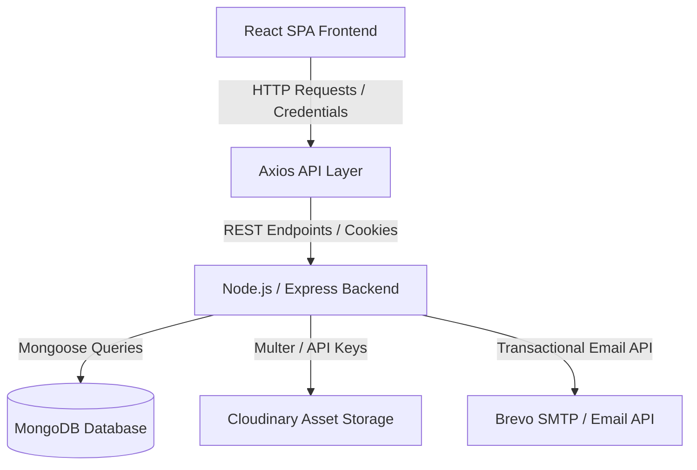

# Sky Lounge Restaurant — Premium Restaurant Management & Ordering Platform


A modern, full-stack,  client web application for **Sky Lounge Restaurant**. Built with React 18, Vite, and Tailwind CSS, this interactive single-page application (SPA) delivers a high-end dining and ordering experience. It includes real-time menu browsing with category filters, dynamic cart synchronization, table reservation requests, customer reviews, OTP-based password resets, customer order tracking, and an administrative control panel with Cloudinary image management.

---

## 🔗 Live Demo

**Live Demo**: https://sky-lounge-dbd.vercel.app/

---

## 🖼️ Application Preview & Screenshots

> [!NOTE]
> Below are screenshot placeholders demonstrating key pages and flows of the client application.

### Customer Facing Interface

- **Home Page**
  
  *Features ambient hero section, admin-curated popular categories, chef specials, and customer review highlights.* 

- **Menu Page**
  
  *Full menu catalog with category filter tabs, search bar, pagination, and sold-out indicators.*

- **Food Details (Quick View Modal)**
  
  *Modal popup showcasing high-resolution food images, portion pricing options, ingredient details, and instant add-to-cart.*

- **Cart Page**
  
  *Interactive cart drawer/page supporting item quantity adjustments, portion selection, subtotal calculation, and persistence.*

- **Checkout Page**
  
  *Clean order placement interface with address entry, contact validation, order summary breakdown, and cash/online payment selection.*

- **My Orders**
  
  *Personal order history dashboard showing past orders, item details, payment status, and order stage indicators.*

- **Order Tracking**
  
  *Fresh progress bar tracking order stages (`Pending` ➔ `Preparing` ➔ `Ready` ➔ `Delivered`).*

- **Table Reservations**
  
  *Reservation request form allowing date, time slot, party size selection, and personal requests.*

- **Customer Reviews**
  
  *Interactive review submission modal and full list view of admin-approved customer ratings and feedback.*

---

### Admin Portal

- **Admin Dashboard**
  
  *Real-time metrics dashboard displaying revenue statistics, order totals, active reservations, popular items, and registered users.*

- **Admin Menu Management**
  
  *Complete CRUD table for menu items with availability toggles, price updates, and direct Cloudinary image uploads.*

- **Admin Orders Management**
  
  *Order dispatch system enabling real-time status transitions (`Pending`, `Preparing`, `Ready`, `Delivered`, `Cancelled`) and payment verification.*

- **Admin Gallery Management**
  
  *Image gallery manager for restaurant ambiance photos with category tagging and Cloudinary asset removal.*

---

## ✨ Implemented Key Features

### 🎨 User Interface & Experience
- **Premium Restaurant Aesthetics**: Glassmorphic UI overlays, ambient dark sections, gold design accents, and smooth transitions powered by Tailwind CSS & Framer Motion.
- **Light/Dark Theme Switcher**: Full dual-theme support with **Light Theme enabled by default** on first visit and user choice persisted in `localStorage`.
- **Responsive Layout**: Tailored responsive layouts optimized across mobile handsets, tablets, laptops, and desktop screens.

### 🍽️ Menu & Browsing
- **Category Filtering & Search**: Instant client/server filtering across categories (Appetizers, Main Course, Desserts, Beverages) and live text search.
- **Admin-Curated Popular Categories**: Home page feature highlights dynamically fetched based on admin category settings.
- **Menu Pagination**: Server-assisted pagination handling large menu catalogs smoothly.
- **Sold-Out Item Handling**: Automated visual disabled state for items marked `isAvailable: false`, preventing accidental orders.
- **Quick View Modal**: Inspect dish pricing variations, description details, and images without leaving the page.

### 🛒 Cart & Checkout Management
- **User Cart Synchronization**: Cart state automatically syncs between local storage and backend MongoDB database per logged-in user.
- **Portion & Quantity Control**: Modify portion sizes (e.g., Half/Full) and quantity increments with live subtotal math.
- **Seamless Checkout**: Address validation, contact phone check, order breakdown, and instant order placement.

### 🔐 Auth & Security
- **Authentication System**: Secure register, login, profile updates, and logout routines.
- **JWT & HTTP-Only Cookies**: Automatic credential transmission via HTTP-only cookie configuration.
- **Forgot Password with OTP**: 3-step password recovery flow featuring 6-digit OTP email dispatch (via Brevo) and password reset validation.
- **Protected Client Routes**: Page navigation guards (`ProtectedRoute` & `AdminRoute`) redirecting unauthorized visitors.

### 📦 Customer Order & Reservation Tracking
- **Order Tracking**: Search order status by Order Number or view live progress (`Pending`, `Preparing`, `Ready`, `Delivered`).
- **My Reservations**: View submitted table booking details, guest counts, requested time slots, and approval status.
- **Customer Reviews**: Submit ratings (1–5 stars) and review text; view community feedback approved by restaurant admins.

### 👑 Admin Management Dashboard
- **Analytics Overview**: View revenue overview metrics, total active orders, total customer reservations, and registered users.
- **Menu Item CRUD**: Add, update, delete, or toggle availability for dishes.
- **Cloudinary Image Uploader**: Custom image uploader component with drag/drop, local blob previews, direct Cloudinary uploads, and automatic server image deletion.
- **Category & Popularity Manager**: Create categories, assign display order, upload category imagery, and toggle home page popular status.
- **Order Status Control**: Filter orders by status or user, transition order stages, and update payment statuses (Paid/Unpaid).
- **User History Search**: Search registered users by name or email and inspect complete past order histories for administrative assistance.
- **Gallery & Review Moderation**: Approve/reject customer reviews and manage restaurant photo gallery items.

---

## 🛠️ Tech Stack

| Category | Technology / Library | Usage Purpose |
| :--- | :--- | :--- |
| **Core Framework** | React 18.3 | SPA component hierarchy & state rendering |
| **Build Tool** | Vite 5.2 | Fast HMR development server & production bundler |
| **Routing** | React Router DOM 6.23 | Client-side routing, nested layouts & route protection |
| **Styling** | Tailwind CSS 3.4 | Utility-first responsive styling & dark mode setup |
| **HTTP Client** | Axios 1.7 | REST API communication with credentials support |
| **Form Handling** | React Hook Form 7.51 | Performant form state management |
| **Validation** | Zod 3.23 + @hookform/resolvers | Client-side schema validation |
| **Icons** | Lucide React & React Icons | UI icons for navigation, status, & actions |
| **Animations** | Framer Motion 11.2 | Smooth modal transitions & UI micro-interactions |
| **Media Service** | Cloudinary API | Cloud image hosting & asset management |

---

## 📐 Application Architecture



### Authentication & Protected Route Flow
1. **Initial Mount**: `AuthContext` calls `/api/auth/me` on application launch to restore user sessions via HTTP-Only JWT cookies.
2. **Customer Guard (`ProtectedRoute`)**: Wraps routes like `/cart`, `/checkout`, `/reservation`, `/my-orders`, and `/my-reservations`. If unauthenticated, user is redirected to `/login` with return location state.
3. **Admin Guard (`AdminRoute`)**: Wraps all  sub-routes. Verifies user authentication and confirms `user.role === 'admin'`. Non-admin users are restricted.

---

## 📂 Project Structure

```
frontend/
├── src/
│   ├── components/
│   │   ├── admin/
│   │   │   ├── AdminNavbar.jsx          # Top navigation bar for admin panel
│   │   │   └── AdminSidebar.jsx         # Sidebar navigation for admin sections
│   │   └── common/
│   │       ├── FoodCard.jsx             # Reusable dish display card
│   │       ├── Footer.jsx               # Main application footer
│   │       ├── ImageUploader.jsx        # Cloudinary upload component with preview
│   │       ├── Navbar.jsx               # Primary responsive navigation bar
│   │       ├── Pagination.jsx           # Catalog page control component
│   │       ├── QuickViewModal.jsx       # Dish details modal popup
│   │       ├── ReviewsModal.jsx         # Customer review list modal
│   │       ├── SkeletonLoader.jsx       # Content loading placeholder
│   │       └── WhatsAppButton.jsx       # Quick contact floating widget
│   ├── context/
│   │   ├── AuthContext.jsx              # Global user session & auth state
│   │   ├── CartContext.jsx              # Cart state, persistence & backend sync
│   │   ├── ThemeContext.jsx             # Dual theme (Light/Dark) provider
│   │   └── ToastContext.jsx             # Global toast notifications state
│   ├── layouts/
│   │   ├── AdminLayout.jsx              # Admin panel wrapper layout
│   │   └── PublicLayout.jsx             # Public customer wrapper layout
│   ├── pages/
│   │   ├── About.jsx                    # Restaurant story & ambiance page
│   │   ├── AddMenuItemPage.jsx          # Admin form to add new dishes
│   │   ├── AdminDashboardPage.jsx       # Admin analytics & system statistics
│   │   ├── AdminLoginPage.jsx           # Separate login interface for staff
│   │   ├── AdminProfilePage.jsx         # Admin personal profile page
│   │   ├── CartPage.jsx                 # Shopping cart overview page
│   │   ├── CheckoutPage.jsx             # Order placement & address entry
│   │   ├── Contact.jsx                  # Location, map & inquiry form
│   │   ├── EditMenuItemPage.jsx         # Admin form to modify existing dishes
│   │   ├── ForgotPasswordPage.jsx       # Email entry & OTP verification
│   │   ├── GalleryPage.jsx              # Customer food & lounge photo gallery
│   │   ├── Home.jsx                     # Landing page with hero, categories & specials
│   │   ├── LoginPage.jsx                # Customer login interface
│   │   ├── ManageCategoriesPage.jsx     # Admin category CRUD & popular toggles
│   │   ├── ManageGalleryPage.jsx        # Admin gallery image uploader
│   │   ├── ManageMenuPage.jsx           # Admin menu item list & actions
│   │   ├── ManageOrdersPage.jsx         # Admin order tracking & status updates
│   │   ├── ManageReservationsPage.jsx   # Admin table booking manager
│   │   ├── ManageReviewsPage.jsx        # Admin review moderation page
│   │   ├── ManageUsersPage.jsx          # Admin user search & history viewer
│   │   ├── Menu.jsx                     # Interactive dish catalog page
│   │   ├── MyOrdersPage.jsx             # Customer personal order history
│   │   ├── MyReservationsPage.jsx       # Customer personal table reservations
│   │   ├── NotFoundPage.jsx             # 404 custom fallback page
│   │   ├── OrderDetailsPage.jsx         # Detailed invoice view for orders
│   │   ├── OrderTrackingPage.jsx        # Order status tracking screen
│   │   ├── RegisterPage.jsx             # Customer account creation
│   │   ├── ReservationPage.jsx          # Customer table booking request form
│   │   ├── ResetPasswordPage.jsx        # New password entry screen
│   │   └── UserProfilePage.jsx          # Customer account profile management
│   ├── routes/
│   │   ├── AdminRoute.jsx               # Protected route guard for Admin
│   │   ├── AppRoutes.jsx                # Central route registry & switch
│   │   └── ProtectedRoute.jsx           # Protected route guard for authenticated users
│   ├── services/
│   │   └── api.js                       # Axios instance configured with credentials
│   ├── utils/
│   │   └── imageUtils.js                # Image URL resolution & Cloudinary helpers
│   ├── App.jsx                          # Main app component with providers
│   ├── index.css                        # Tailwind directives & theme styles
│   └── main.jsx                         # Application entry point
├── index.html                           # HTML template
├── package.json                         # Project dependencies & scripts
├── postcss.config.js                    # PostCSS processor config
├── tailwind.config.js                   # Tailwind CSS theme customization
└── vite.config.js                       # Vite configuration & proxy settings
```

---

## 🔑 Environment Variables

Create a `.env` file in the root of the `frontend/` directory:

```env
# API Base URL (Optional if using Vite proxy)
VITE_API_URL=http://localhost:5000/api
```

> [!WARNING]
> Never commit actual environment files (`.env`) or secret keys to version control. Always include `.env` in your `.gitignore` file.

---

## ⚡ Installation & Running Locally

### Prerequisites
- **Node.js**: `v18.x` or higher
- **npm**: `v9.x` or higher

### Steps

1. **Clone the Repository**
   ```bash
   git clone <frontend-repository-url>
   cd frontend
   ```

2. **Install Dependencies**
   ```bash
   npm install
   ```

3. **Start Development Server**
   ```bash
   npm run dev
   ```
   *The client application will start at `http://localhost:5173`.*

4. **Build for Production**
   ```bash
   npm run build
   ```

5. **Preview Production Build**
   ```bash
   npm run preview
   ```

---

## 🔒 Authentication & Client Security

- **Cookie-Based JWT Sessioning**: The client relies on secure, HTTP-Only cookies returned by the backend upon successful authentication, shielding tokens from XSS vulnerabilities.
- **Route Guard Protection**: Navigation is gated dynamically using custom React components (`ProtectedRoute` and `AdminRoute`) that verify login states before rendering sensitive pages.
- **Role Isolation**: Admin dashboard interfaces and management capabilities are strictly restricted to accounts possessing the `admin` role.
- **User Data Isolation**: Carts and personal order histories are bound strictly to the logged-in user context ID.

---

## 📱 Responsive & Theme Design

- **Mobile First Approach**: Interfaces are designed with adaptive layouts, dynamic mobile navigation drawer menus, touch-friendly touch targets, and responsive grids.
- **Dual Theme Support**: Implemented via custom CSS variables and Tailwind's `dark` mode class strategy.
- **Theme Persistence**: Light mode is loaded by default for new visitors, and user preference toggles are persisted in `localStorage`.

---

## 🚀 Future Improvements

- [ ] **PWA Support**: Offline caching and installable progressive web app capabilities.
- [ ] **Socket.io Integration**: Push notifications for immediate order status updates without polling.
- [ ] **Multi-language Support (i18n)**: Internationalization for global customer bases.
- [ ] **Interactive Table Picker**: Visual 2D floor plan for selecting specific dining tables during reservation.

---

## 👨‍💻 Author

**Abdullah Ansari**

- **GitHub**: https://github.com/Abdullah-NI
- **LinkedIn**: https://www.linkedin.com/in/abdullah-ansari-dbd

